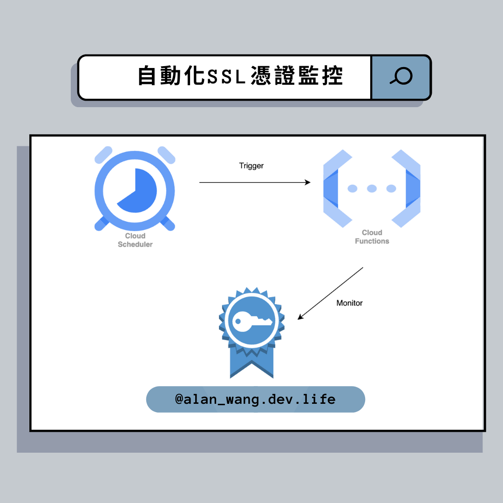
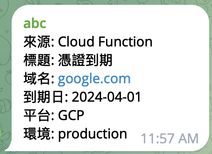
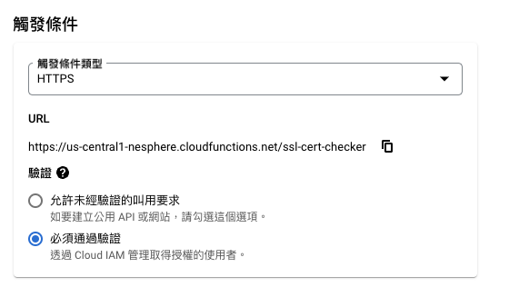
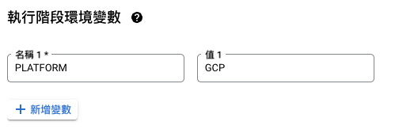
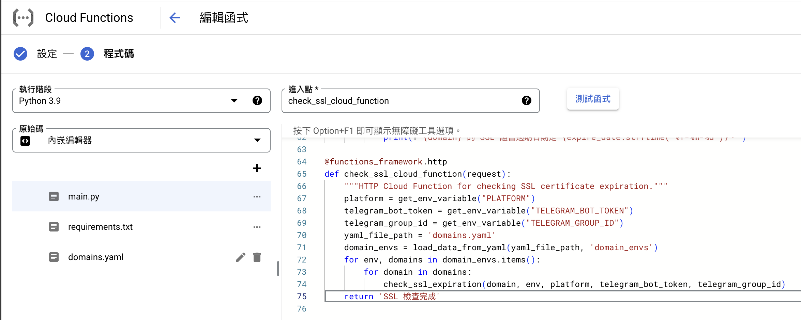
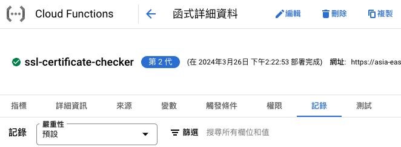
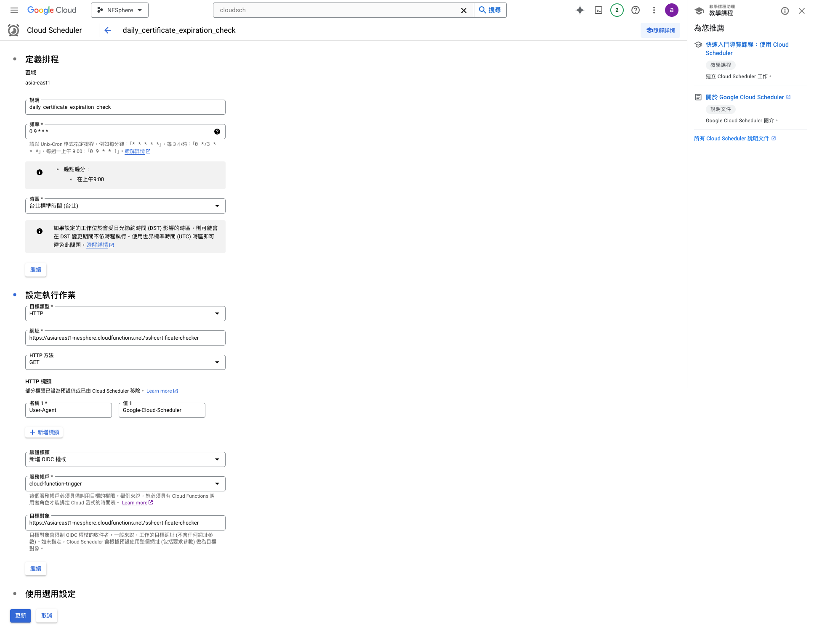

## 👨‍💻 簡介

最近因為憑證越來越多，需要監控什麼時候到期，當到期時發送到期通知，因此撰寫一個簡單的小程式來完成。

這次使用 Python 和 Telegram Bot 來監控 SSL 證書的到期時間並發送通知。並使用 GCP 工具，如 CloudFunction 和 CloudScheduler 做部署平台。

## 🛠️ 使用工具

- Python 3.9
- Telegram Bot(Webhook)
- CloudFunction
- CloudScheduler

## 📝 功能需求

1. 取得憑證到期時間
2. 到期後發送通知
3. 透過 Telegram Bot 發送訊息
4. 讀取 yaml domain list
5. 設定環境變數
6. CloudFunction 設定
7. CloudScheduler 排程設定

## 🎯Setup

### 1. 取得憑證到期時間

```python
def get_ssl_cert_expiry_date(domain):
    """
    取得 SSL 證書的過期日期。

    參數:
        domain (str): 需要檢查SSL證書過期時間的 domain 。

    返回:
        datetime: SSL證書的過期日期，如果獲取失敗則返回None。
    """
    # 建立SSL上下文，建立一個安全的“環境”來管理SSL設定和操作
    ssl_context = ssl.create_default_context()
    # 包裝socket對象，將基礎的socket通訊轉變為加密通訊
    conn = ssl_context.wrap_socket(socket.socket(socket.AF_INET), server_hostname=domain)
    # 設定連接的超時時間為 3 秒，防止長時間等待
    conn.settimeout(3.0)
    try:
        # 通過加密的連線嘗試連接到服務器的443端口（HTTPS）
        conn.connect((domain, 443))
        # 取得服務器的SSL證書訊息
        ssl_info = conn.getpeercert()
        # 解析證書中的過期時間
        expire_date = datetime.strptime(ssl_info['notAfter'], '%b %d %H:%M:%S %Y %Z')
        return expire_date
    except Exception as e:
        # 處理連接或取得證書訊息過程中的異常
        print(f"無法獲取 {domain} 的 SSL 證書過期日期，錯誤：{e}")
        return None
    finally:
        # 確保無論成功與否，都關閉與服務器的連接
        conn.close()
```

這部分使用了 python 的 ssl 以及 socket library，他們幫助我能夠建立安全的加密環境，以及使用 socket 進行通訊，使我能夠取得憑證相關資訊。

補充一下 `datetime.strptime`，因為從 `ssl_info` dict 解析後的 `notAfter` 會回傳 `'Mar  4 06:35:50 2024 GMT`，因此需要透過 `datetime.strptime`，將字串解析成 datetime 對象。

字符串格式如下：

- `%b`：月份的縮寫名稱，如 Jan, Feb, Mar 等。
- `%d`：月份中的天數，為 01 到 31。
- `%H`：小時（24 小時制），從 00 到 23。
- `%M`：分鐘，從 00 到 59。
- `%S`：秒，從 00 到 59。
- `%Y`：4 位數的年份，如 2024。
- `%Z`：時區名稱，如 UTC 或 EST 等。

對應欄位：

```
Mar  4 06:35:50 2024 GMT
月   日 時 分 秒  年   時區
%b  %d %H:%M:%S %Y   %Z
```

至此，取得憑證過期時間完成，接下來需要建立一個 function 幫助我判斷當小於 30 天時，需要發送通知，我們往第二部分進行。

### 2. 到期後發送通知

邏輯判斷會需要讓返回的時間能夠與當前時間做比較，當小於等於 30 天時，則會發送通知。

```python
def check_ssl_expiration(domain):
    """
    檢查給定 domain 的SSL證書過期時間，並在證書即將過期時印出。

    參數:
        domain (str): 需要檢查SSL證書的 domain 。
    """
    # 調用先前定義的函數get_ssl_cert_expiry_date來獲取SSL證書的過期日期。
    expire_date = get_ssl_cert_expiry_date(domain)
    # 如果成功取得到過期日期
    if expire_date:
        # 計算證書的剩餘有效天數
        remaining_days = (expire_date - datetime.utcnow()).days
        # 如果剩餘天數不超過30天
        if remaining_days <= 30:
            # 印出一條log訊息，說明證書將在指定天數內過期
            print(f"{domain} 的 SSL 證書將在 {remaining_days} 天內過期。")
        else:
            # 如果證書的剩餘有效期超過30天，則打印證書的過期日
            print(f"{domain} 的 SSL 證書過期日期是 {expire_date.strftime('%Y-%m-%d')}。")
```

補充說明一下 `datetime` 以及 `strftime` 的用法：

- `datetime.utcnow()`
  這個 library 在這裡主要取得 UTC 的當前日期和時間

```python
>>> from datetime import datetime
>>> datetime.utcnow()
## 返回一個`datetime.datetime`對象，這個對象包含了當前UTC時區的年、月、日、小時、分、秒，以及微秒。
datetime.datetime(2024, 4, 1, 15, 34, 21, 211636)
```

代表執行 `datetime.utcnow()` 時，被執行的時間是 2024 年 4 月 1 日，下午 3 點 34 分 21 秒，以及 211636 微秒。

- `strftime()`

這個方法主要用來將時間對象轉為字串，方便組成要傳送的訊息。
`"%Y-%m-%d"` 是 `strftime` 方法的格式化字串參數，其中 `%Y` 表示 4 位數的年份，`%m`表示月份（01 至 12），`%d` 表示月份中的天數（01 至 31）。

整段 function 功能描述為：首先，使用 `datetime.utcnow()` 取得當前 UTC 時間，然後與 `expire_date` 進行相減，計算出證書的剩餘有效天數。

如果這個剩餘天數不超過 30 天，就印出一條 log 訊息，說明證書將在指定天數內過期；否則印出證書的過期日期。

### 3. 發送訊息到 telegram group

```python
def send_notification(message, domain, telegram_bot_token, telegram_group_id):
    """
    通過指定的Webhook URL發送通知。

    參數:
        message (dict): 要發送的消息內容，格式為字典。
        domain (str):  domain ，用於發送消息中表示哪個 domain 的SSL證書。
        telegram_token (str): 要使用的telegram bot token。
        telegram_group_id (str): 指定發送消息的群組。
    """
    telegram_send_message_url = f"https://api.telegram.org/bot{telegram_bot_token}/sendMessage"
    # 向telegram api發送HTTP POST請求。
    response = requests.post(telegram_send_message_url, data={
        "chat_id": telegram_group_id,
        "text": message
    })

    # 檢查響應的狀態碼。如果狀態碼為200，表示通知發送成功。
    if response.status_code == 200:
        print(f"已為 {domain} 發送通知")
    else:
        # 如果狀態碼不是200，表示發送失敗。
        print(f"為 {domain} 發送失敗")
```

將 `send_notification` 新增到 `check_ssl_expiration`，這裡應該有更好的作法。

```python
def check_ssl_expiration(domain, env, platform, telegram_bot_token, telegram_group_id):
    """
    檢查給定 domain 的SSL證書過期時間，並在證書即將過期時通過webhook發送通知。

    參數:
        domain (str): 需要檢查SSL證書的 domain 。
        env (str): 環境標籤（例如：開發、測試、正式），用於消息中以區分不同環境。
        platform (str): 平台標籤（例如：AWS、GCP、Azure），用於消息中以標明證書部署的平台。
        telegram_token (str): 要使用的telegram bot token。
        telegram_group_id (str): 指定發送消息的群組。
    """
    expire_date = get_ssl_cert_expiry_date(domain)
    if expire_date:
        remaining_days = (expire_date - datetime.utcnow()).days
        if remaining_days <= 30:
            # 建立發送訊息，包含了證書到期的相關訊息
            message = "\n".join([
			    "來源: Gitlab-Runner",
			    "標題: 憑證到期",
			    f"domain : {domain}",
			    f"到期日: {expire_date.strftime('%Y-%m-%d')}",
			    f"平台: {platform}",
			    f"環境: {env}",
			])

            print(f"{domain} 的 SSL 證書將在 {remaining_days} 天內過期。")
            send_notification(message, domain, telegram_bot_token, telegram_group_id)
        else:
            print(f"{domain} 的 SSL 證書過期日期是 {expire_date.strftime('%Y-%m-%d')}。")
```

這裡我使用的是簡單的 telegram bot，發送後會呈現如下資訊。


### 4. 讀取 yaml domain list

假設 domain.yaml 如下

```yaml
domain_envs:
  live:
    - google.com
    - en.wikipedia.org
```

```python
def load_data_from_yaml(yaml_file_path, key):
    """
    從YAML檔案加載指定鍵的配置。

    參數:
        yaml_file_path (str): YAML檔案的路徑。
        key (str): 要從YAML檔案中讀取的鍵名。

    返回:
        dict or None: 返回從YAML檔案中讀取的配置字典。如果指定的鍵不存在，則返回空字典。
    """
    try:
        # 嘗試打開指定的YAML檔案。'r'表示以讀取模式打開，'encoding='utf-8''確保文件正確讀取UTF-8編碼的內容。
        with open(yaml_file_path, 'r', encoding='utf-8') as file:
            # 使用yaml.safe_load(file)安全地加載YAML檔案的內容。
            # 此函數將YAML檔案的結構轉換為Python資料類型（通常是字典）。
            data = yaml.safe_load(file)
            # 嘗試從加載的資料中獲取特定鍵（key）的值。
            # 如果鍵不存在，則默認返回一個空字典{}。
            return data.get(key, {})
    except FileNotFoundError as e:
        # 如果嘗試打開的YAML檔案不存在，則捕獲FileNotFoundError異常。
        logging.error(f"YAML檔案未找到: {e}")
        # 錯誤日誌記錄後，返回一個空字典{}，表示沒有加載到任何資料。
        return {}
    except Exception as e:
        # 如果在加載或處理YAML檔案時發生了其他任何異常，則捕獲通用異常。
        logging.error(f"讀取YAML檔案時發生錯誤: {e}")
        # 同樣記錄錯誤日誌並返回一個空字典{}。
        return {}

yaml_file_path = 'config.yaml'
domain_envs = load_data_from_yaml(yaml_file_path, 'domain_envs')
```

這裡主要使用 `yaml` 進行一些讀取操作，使我可以獲取到 `domain_envs`。
印出的格式如下：

```python
{'live': ['google.com', 'en.wikipedia.org']}
```

而要取得到 env 以及各個 domain，則使用 for 迴圈進行迭代，將每個 item 都取得；而 domain 因為有多個所以會再使用一個 for 迴圈進行迭代，並一一進行確認證書狀態。

```python
for env, domains in domain_envs.items():
    for domain in domains:
        check_ssl_expiration(domain, env, platform, telegram_bot_token, telegram_group_id)
```

### 5. 設定環境變數

這部分是使用 `os.environ.get` 方法，取得環境變數的值

```python
def get_env_variable(name, default_value="未設定"):
    """
    從系統環境變數中取得一個值。

    參數:
        name (str): 環境變數的鍵名。
        default_value (str): 如果找不到鍵，則返回的預設值。預設為"未設定"。

    返回:
        str: 環境變數的值，或者在找不到鍵時返回預設值。
    """
    return os.environ.get(name, default_value)

```

接著在入口函數設定，取得相關環境變數

```python
platform = get_env_variable("PLATFORM")
telegram_bot_token = get_env_variable("TELEGRAM_BOT_TOKEN")
telegram_group_id = get_env_variable("TELEGRAM_GROUP_ID")
```

### 6. cloudfunction 設定

- 觸發條件選擇 HTTPS，並且須通過驗證



- 執行環境變數，需要將原本從系統取得的環境變數在這裡設定



- 入口函數需要將原先寫在 main function 的部分移到這裡



設定好後可以測試看看是否正常，可在紀錄查看執行結果


### 7. cloudscheduler 排程設定

要先設定 IAM，允許可呼叫 cloud function，先建立好 service account 後，加入兩個角色，Cloud Functions 管理員以及 Cloud Run 叫用者。

接著就能到 cloudscheduler 進行相關設定。


這樣就完成了監控憑證的小程式了。

🔗 專案 repo --> [ssl-certificate-checker](https://github.com/sz9751210/monitor/tree/main/monitor-ssl)

## 📚Reference

- [ssl — TLS/SSL wrapper for socket objects — Python 3.12.2 documentation](https://docs.python.org/3.12/library/ssl.html#ssl.SSLSocket.getpeercert)
- [socket — Low-level networking interface — Python 3.12.2 documentation](https://docs.python.org/3/library/socket.html#socket.socket)
- [datetime — Basic date and time types — Python 3.12.2 documentation](https://docs.python.org/3/library/datetime.html)
- [Cloud Functions 文档  |  Google Cloud](https://cloud.google.com/functions/docs?hl=zh-cn)
- [Google Cloud Scheduler 文档](https://cloud.google.com/scheduler/docs?hl=zh-cn)
